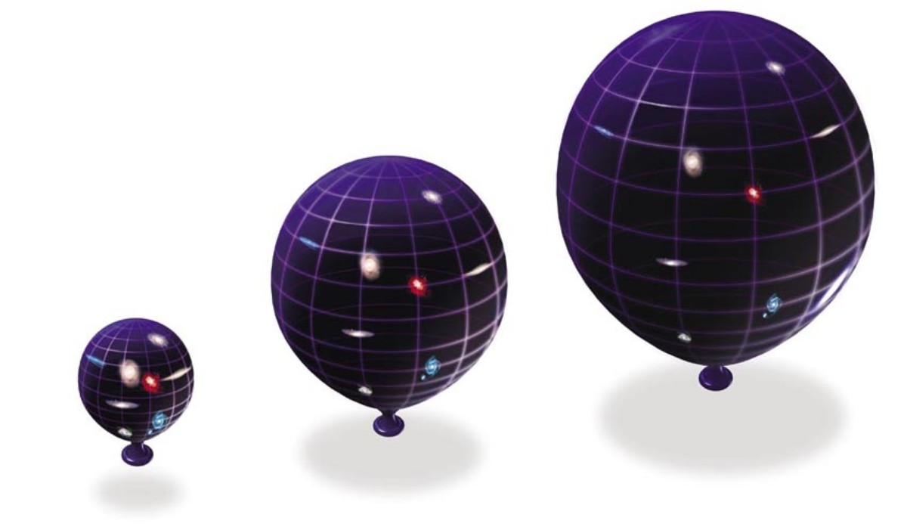
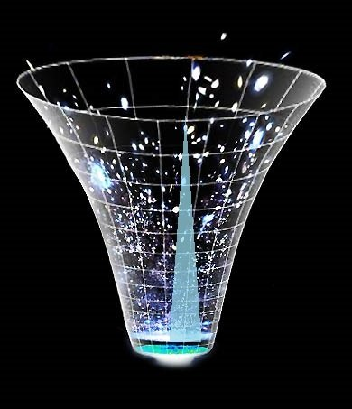

# কসমোলজি {#cosmology}

## মহাবিশ্বের সীমানার খোঁজে

এই মহাবিশ্বের শেষ কোথায়? প্রশ্নটি শুধু কিশোর মনে নয়, জাগে বড়দের মনেও। যেখানে মহাবিশ্বের শেষ, তার পরেই বা কী আছে? আমরা তো জানি,  মহাবিশ্ব প্রসারিত হচ্ছে। মানে বড় হচ্ছে। কিন্তু কোথায় প্রসারিত হচ্ছে? সেখানে আগে থেকে কী ছিল? কী আছে আমাদের চেনা-জানা  মহাবিশ্বের বাইরে? 

এর উত্তর যদি দেওয়াই হয়, তাহলে মনে হবে  মহাবিশ্বের বুঝি কোনো একটি প্রান্ত আছে। কথাটি বেশ সহজে বলে ফেলা গেলেও তা মোটেই অত সোজা বিষয় নয়। যেমন উপরের প্রশ্নগুলোর আরেকটি রূপ হলো এমন, ‘আমরা কি এমন কোথাও যেতে পারি, যেখান থেকে  মহাবিশ্বের বাইরের অবস্থা দেখা যায়?’ যেভাবে আমরা জানালা দিয়ে উঁকি দিলেই বাইরের পরিবেশ দেখতে পাই, সেভাবে কি  মহাবিশ্বের বাইরের রূপ দেখতে পারি? খুব সম্ভবত, না।  

একটি কারণ হলো মহাজাগতিক নীতি (cosmological principle)। নীতিটি অনুসারে, আমরা  মহাবিশ্বের যেদিকেই তাকাই, একই রূপ দেখতে পাই। যে কোনো দিক থেকে  মহাবিশ্বকে একই রকম দেখায়। বিজ্ঞানীরা একে বলেন আইসোট্রপিক  মহাবিশ্ব। এই নীতি আবার পদার্থবিদ্যার আরেকটি সূত্রেরই একটি রূপ। পদার্থবিদ্যার সূত্রগুলো সর্বত্র একইভাবে কাজ করে। হ্যাঁ, অল্প জায়গা বিবেচনা করলে একটু ভিন্নতা চোখে পড়বে বটে। যে কোনো দিকে তাকালেই তো শুক্র, বৃহস্পতি চোখে পড়বে না। কিন্তু বড় মাপকাঠিতে তাকালেই  মহাবিশ্ব সব দিকে একই রকম হয়ে যাবে। যে কোনো দিকে দেখা যাবে সমান সসেকেন্ডখ্যক ও একই রকমের প্রায় সমান সসেকেন্ডখ্যক ছায়াপথ। 

উপরের নীতির একটি ব্যাখ্যা হলো,  মহাবিশ্বের কোনো প্রান্ত নেই। এমন কোনো জায়গা নেই, যেখানে গেলে আমরা  মহাবিশ্বের বাইরে উঁকি দিতে পারব। দেখতে পারব, কী আছে বাইরে। 

প্রান্তহীন এই  মহাবিশ্বের ধারণা সহজে বলার জন্যে অনেক সময় বেলুনের উদাহরণ দেওয়া হয়। ধরা যাক, বেলুনের পৃষ্ঠে একটি পিঁপড়া হাঁটছে। এটি যে কোনো দিকে হাঁটতে পারে ইচ্ছে মতো। কিন্তু বেলুনের পৃষ্ঠে বেচারা পিঁপড়া কোনো প্রান্ত খুঁজে পাবে না। বেলুনের পৃষ্ঠের ক্ষেত্রফল নির্দিষ্ট হলেও তার কোনো সীমানা নেই। পৃষ্ঠে কোনো নির্দিষ্ট কেন্দ্রও নেই। ফলে বিশেষ কোনোও বিন্দুরও অস্তিত্ব নেই। তবে বেলুনের পৃষ্ঠ দ্বিমাত্রিক। আর  মহাবিশ্ব হলো তার ত্রিমাত্রিক সসেকেন্ডস্করণ। 

কিন্তু  মহাবিশ্ব প্রসারিতও হচ্ছে আবার কেন্দ্রও নেই তা কী করে সম্ভব? আবার ফিরে যাওয়া যাক, বেলুনের কাছে। ধরা যাক, বেলুনের পৃষ্ঠে অনেকগুলো বিন্দু আছে। এখন ফুঁ দিয়ে বেলুনকে আরও বড় করা হলো। ফলে পিঁপড়ারা দেখবে বেলুনের পৃষ্ঠের বিন্দুগুলো দূরে চলে যাচ্ছে। পিঁপড়া থেকে কোনো বিন্দু যত দূরে থাকবে তা তত দূরে সরে যাবে। কিন্তু পিঁপড়াটি যেখানেই থাকুক, দেখবে ঐ একই ঘটনাই। 

তবে বেলুনের সাথে  মহাবিশ্বের পার্থক্য আছে। বেলুনকে ফোলানো হলে তা প্রসারিত হয় ত্রিমাত্রিক স্থানে। এটা আমাদের  মহাবিশ্বের বেলায় খাটে না।  মহাবিশ্বের সসেকেন্ডজ্ঞা অনুসারেই বাইরে কিছু থাকতে পারে না। বেলুনের বাইরে তো আরেকটি জগৎ আছে। কিন্তু সব কিছু নিয়েই তো  মহাবিশ্ব। ‘বাইর’ বলতে কিছু নেই। স্টিফেন হকিসেকেন্ড এর মতে এটা অনেকটা এই প্রশ্নের মতো যে, ‘উত্তর মেরুর উত্তরে কী আছে?’

অস্ট্রেলিয়ার মেলবোর্ন ইউনিভার্সিটির জ্যোতির্পিদার্থবিদ ড. ক্যাটি ম্যাক এর মতে, ‘মহাবিশ্ব প্রসারিত হচ্ছে’ এভাবে না বলে ‘ঘনত্ব কমছে’ বলা ভাল। মানে,  মহাবিশ্বর যত বড় হচ্ছে, পদার্থ তত কমছে। 

আমরা সাধারণত প্রসারণশীল  মহাবিশ্ব বলতে বুঝি, ছায়াপথরা একে অপর থেকে দূরে সরছে। আসলে কিন্তু ঠিক সেটা ঘটছে না। প্রসারণ মানে ‘ছায়াপথরা স্থান ভেদ করে চলছে’ তা নয়। আসলে স্থান নিজেই প্রসারিত হচ্ছে। একটি পুকুর হঠাৎ করে ফুলে উঠলে তার মাছগুলো চলাচল না করেও যেভাবে দূরে সরে যাবে ঠিক তেমনি। ফলে  মহাবিশ্বের যে কোনো স্থানে গেলেই ঐ একই দৃশ্য দেখা যাবে। যেন বাকি সব কিছু দূরে সরছে। 

আবার স্থানের প্রসারণের সাথে ছায়াপথরা দূরে সরছে প্রচ- গতিতে। সে গতি কখনও আবার আলোর বেগকেও ছাড়িয়ে যায়। কিন্তু আইস্টাইনের আপেক্ষিকতা তত্ত্বের প্রতিষ্ঠিত কথা হলো আলোর চেয়ে বেশি বেগ সম্ভব নয়। তবে এখানেও নীতিটির বিরুদ্ধে কিছু হচ্ছে না। কারণ নির্দিষ্ট কোনো বস্তু নির্দিষ্ট কোনো দূরত্ব আলোর চেয়ে বেশি বেগে পাড়ি দিচ্ছে না। স্থান নিজেই প্রসারিত হচ্ছে। তার সাথে চলছে বস্তুগুলো। 

**সীমানা একটা আছে বটে!**

 মহাবিশ্বের বয়স এখন ১৩৭০ কোটি বছর। কোনো বস্তু দেখতে হলে সেখান থেকে আলো এসে আমাদের চোখে পড়ার মতো যথেষ্ট সময় ব্যয় হতে হবে। ওদিকে আলোর বেগ  মহাবিশ্বের সবোচ্চ বেগ হলেও তা অসীম নয়। যদিও সেটা সেকেন্ডে ১ লক্ষ ৮৬ হাজার মাইল। কিন্তু ১৩৭০ কোটি বছর ধরে প্রসারণশীল  মহাবিশ্বের পুরোটা আমাদেরকে দেখানোর মতো বড় নয় আলোর বেগ। জন্মের পর থেকে আমাদের কাছে থেকে  মহাবিশ্বের যত দূরের পর্যন্ত আলো এসে পৌঁছতে পেরেছে তার পুরোটার নাম পর্যবেক্ষণযোগ্য  মহাবিশ্ব (observable universe)। হিসাব করে দেখা যায়, এই পর্যবেক্ষণযোগ্য  মহাবিশ্ব ৯,২০০ কোটি আলোকবর্ষ (আলো এক বছরে যত দূর যায়) চওড়া। 

তার মানে এই পরিসরের বাইরের কিছু আমরা কখনও দেখব না। কারণ, ক্রমেই দ্রুততর বেগে  মহাবিশ্বের দূরের অঞ্চলগুলো চলে যাচ্ছে আরও আরও দূরে। আগেই বলেছি, যে অঞ্চল যত দূরে আছে, সেটি তত জোরে সরে যাচ্ছে। আলো যে বেগে আসছে, ঐ অঞ্চল তার চেয়ে দ্রুত সরে যাচ্ছে। ফলে ৯,২০০ কোটি আলোকবর্ষের বাইরের কোনো কিছু আমরা কখনই দেখব না।  

প্রসারণ আবার সব সময় একই হারে হয়নি। জন্মের খুব পরপর হঠাৎ করে  মহাবিশ্ব অনেক বড় হয়ে যায়। এ ঘটনার নাম স্ফীতি (inflation)। সেই সময়  মহাবিশ্ব কিছুক্ষণের জন্যে বর্তমানের চেয়েও দ্রুত প্রসারিত হয়েছিল। স্ফীতিকে সঠিক ধরে নিলে প্রকৃত  মহাবিশ্বের আকার পর্যবেক্ষণযোগ্য  মহাবিশ্বের আকারের ১০২৩ গুণ হয়। এক এর পরে ২৩ টি শূন্য দিলে যা হয় সসেকেন্ডখ্যাটি তত। ফলে  মহাবিশ্বের একটি সীমানা সত্যিই আছে। সমস্যা হলো মর্ত্যরে মানুষ সেটা কখনও দেখতে পারবে না। 

**সূত্র**

- অ্যান্ড্রু লিডল/ ইন্ট্রুডাকশন টু মডার্ন অ্যাস্ট্রোনমি, লাইভ সায়েন্স ডট কম। 

## আলোর বেগের হার যেখানে

এ অংশটি এখনও উন্মুক্ত নয় 

## মহাবিশ্বের কেন্দ্র কোথায়?

কোত্থাও না! 

কসমোলজির আদর্শ থিওরি অনুযায়ী  প্রায় ১৪ শত কোটি বছর আগে একটি বৃহৎ বিস্ফোরণের মাধ্যমে মহাবিশ্বের যাত্রা শুরু। তার পর থেকেই মহাবিশ্ব সম্প্রসারিত হচ্ছে। কিন্তু তবু প্রসারণের নেই কোন কেন্দ্র। সব দিকে একই রকম দেখতে। বিগ ব্যাংকে সাধারণ কোনো বিস্ফোরণ মনে করা ঠিক হবে না। মহাবিশ্ব কোনো কেন্দ্র থেকে ছড়িয়ে পড়ছে না। বরং, সমগ্র মহাবিশ্বই প্রসারিত হচ্ছে। 

আমরা এখন পর্যন্ত যা জানি, মহাবিশ্ব সব দিকেই সমানভাবে প্রসারিত হচ্ছে।

১৯২৯ সালে এডুইন হাবল বলেন, তিনি আমাদের থেকে বিভিন্ন দূরত্বের গ্যালাক্সিদের বেগ মেপেছেন, আর তারা যতই দূরে যাছে ততই তাদের বেগ বেড়ে যাচ্ছে। এতে করে মনে হতে পারে, আমরা তাহলে মহাবিশ্বের কেন্দ্রে আছি। কিন্তু প্রকৃতপক্ষে মহাবিশ্ব যদি হাবলের সূত্রানুযায়ী সুষমভাবে সম্প্রসারিত হয়, তাহলে যে কোন জায়গাকেই এই রকম কেন্দ্র মনে হবে।

আমরা যদি একটি গ্যালাক্সিকে (নাম দিলাম খ) প্রতি সেকেন্ডে ১০, ০০০ কি.মি. বেগে দূরে সরে যেতে দেখি তাহলে গ্যালাক্সি খ এর একজন এলিয়েন আমাদের গ্যালাক্সি 'ক' কে একই বেগে বিপরীত দিকে যেতে দেখবে। যদি 'খ' গ্যালাক্সির দিকেই আরেকটি গ্যালাক্সি 'গ' থাকে, তাকে আমরা সেকেন্ডে ২০, ০০০ কি.মি. বেগে সরে যেতে দেখবো। 'খ' গ্যালাক্সির এলিয়েন 'গ' কে সেকেন্ডে ১০, ০০০ কি.মি বেগে সরতে দেখবে।

কোন গ্যালাক্সি থেকে অন্য গ্যালাক্সির বেগ কেমন দেখাবে তার সারণী দেখুন। 

                   ক                  খ               গ
ক থেকে         ০ কি.মি./সেকেন্ড    ১০,০০০ কি.মি./সেকেন্ড   ২০,০০০ কি.মি./সেকেন্ড
খ থেকে   -১০,০০০ কি.মি./সেকেন্ড         ০ কি.মি./সেকেন্ড   ১০,০০০ কি.মি./সেকেন্ড
 
তাহলে, 'খ' গ্যালাক্সিতে থাকা এলিয়েনও নিজেকে মহাবিশ্বের কেন্দ্র মনে করবে।

**বেলুনের উদাহরণ**

মহাবিশ্বের সম্প্রসারণ বোঝার জন্য স্থানকে একটি সম্প্রসারণশীল বেলুনের সাথে তুলনা করা হয়। আর্থার এডিংটন ১৯৩৩ সালে তাঁর বই *দ্য এক্সপানডিং ইউনিভার্স (The Expanding Universe)* বইয়ে এই উপমা দেন। ফ্রেড হয়েল তাঁর জনপ্রিয় বই *দ্য নেচার অব দ্য ইউনিভার্স (The Nature of The Universe)* বইয়ের ১৯৬০ এর সংস্করণেও একই উপমা প্রয়োগ করেন। হয়েল লেখেন: 

> মার গণিত শাস্রের বাইরের বন্ধুরা আমাকে প্রায়ই বলে, মহাবিশ্বের এই সম্প্রসারণ তারা বুঝতে পারছে না। গণিতের অত শত হিসেব বাদ দিয়ে আমি বেলুনের উপমা দেই যার পৃষ্ঠে আছে অনেকগুলো বিন্দু। বেলুনটা যদি ফেটে যায়, তবে এই বিন্দুগুলো  পরস্পর থেকে দূরে সরতে থাকবে। ঠিক এভাবেই গ্যালাক্সিরাও দূরে সরে।
>
> --- ফ্রেড হয়েল 
 

(\#fig:baloon)Baloon Analogy

বেলুনের উপমাটা আসলেই দারুণ, কিন্তু একে সঠিকভাবে বুঝতে হবে। নইলে এটা আরো বিভ্রান্তির জন্ম দেবে। হয়েল বলেন: 

> অনেকভাবে এই উপমা ভুল দিকে নিয়ে যেতে পারে"। মনে রাখতে হবে, ত্রিমাত্রিক (Three-dimensional) স্থানকে (space) বেলুনের দ্বি-মাত্রিক পৃষ্ঠের সাথে তুলনা করতে হবে। এখানে পৃষ্ট সুষম (uniform) এবং কোনো বিন্দুকে কেন্দ্র মনে করা যাবে না। বেলুনের নিজের কেন্দ্রের অবস্থান পৃষ্ঠে নয়, তাই একে মহাবিশ্বের কেন্দ্রও মনে করা যাবে না। এবার আপনি বেলুনের রেডিয়াল ডিরেকশনকে সময় মনে করতে পারেন।

> 
> --- ফ্রেড হয়েল  

হয়েলের প্রস্তাবনা ছিল এ রকম। কিন্তু এটাও কিছুটা বিভ্রান্তিকর হতে পারে।

পৃষ্ঠের বিন্দুগুলোকে মহাবিশ্বের অংশ মনে না করলেই আরো ভালো হয়। ঊনবিংশ শতকের শুরুতে গাউস আবিষ্কার করেন, স্থানের বৈশিষ্ট্য যেমন বক্রতাকে স্বকীয় রাশিমালা দ্বারাই প্রকাশ করা যায় যে রাশিগুলো কোথায় বক্রতা ঘটছে তা বিবেচনা ছাড়াই পরিমাপ করা যায়। তাহলে, 'স্থান' এর বাইরে অন্য কোনো মাত্রার (dimension) উপস্থিতি না থাকলেও স্থান বাঁকতে পারে। তিনটা পাহাড়ের মাথার মধ্যবর্তী বিশাল ত্রিভুজের কোণ (angle) মাপার মাধ্যমে গাউস 'স্থান' এর বক্রতাও মাপার চেষ্টা করেছিলেন।

বেলুনের উপমা ভাববার সময় মাথায় রাখতে হবে-

* বেলুনের দ্বি-মাত্রিক পৃষ্ঠ ত্রিমাত্রিক স্থানের অনুরূপ।
* যে ত্রিমাত্রিক স্থানে বেলুন আবদ্ধ আছে তা অন্য কোনো উচ্চ-মাত্রিক ভৌত (physical) স্থানের অনুরূপ নয়।
* 'বেলুনের কেন্দ্র' ফিজিকেল কোনো অর্থ বহন করবে না।
* মহাবিশ্বের আকার সসীম হতে পারে যা বেলুনের পৃষ্ঠের মতই প্রসারিত হচ্ছে, আবার অসীমও হতে পারে।
* প্রসারণশীল বেলুনের মতই গ্যালাক্সিরা প্রসারিত হচ্ছে, কিন্তু গ্যালাক্সি নিজে প্রসারিত হচ্ছে না। কারণ তার নিজস্ব অভিকর্ষ।

 সূত্র: 

এমআইটি; ইউনিভার্সিটি অব ক্যালিফোর্নিয়া, রিভঅরসাইড

## মহাবিশ্বের বয়স কত

এ অংশটি এখনও উন্মুক্ত নয়

## মহাবিশ্বে কতগুলো পরমাণূ আছে

এ অংশটি এখনও উন্মুক্ত নয়

## ব্যর্থ তারকাদের গল্প

এ অংশটি এখনও উন্মুক্ত নয়

## মহাবিশ্বের সবচেয়ে রহস্যময় নক্ষত্র

এ অংশটি এখনও উন্মুক্ত নয়

## মহাবিশ্বের ক্ষুদ্রতম নক্ষত্র

এ অংশটি এখনও উন্মুক্ত নয়

## আমার ল্যাপটপ অন কেন?

এ অংশটি এখনও উন্মুক্ত নয়

## শেষ হয়ে যাচ্ছে সূর্য?

## মিল্কিওয়ের নিকটতম গ্যালাক্সি

এ অংশটি এখনও উন্মুক্ত নয়

## আন্তঃছায়ায়াপথীয় সংঘর্ষে নতুন তারা

এ অংশটি এখনও উন্মুক্ত নয়

## আণবিক কৃষ্ণগহ্বরর

এ অংশটি এখনও উন্মুক্ত নয়

## পালসার সঙ্কেতের রহ্যসভেদ

এ অংশটি এখনও উন্মুক্ত নয়

## মহাবিশ্বের প্রসারণ নিয়ে ধূম্রজাল

এ অংশটি এখনও উন্মুক্ত নয়

## ডার্ক ফোটনের সন্ধানে

এ অংশটি এখনও উন্মুক্ত নয়
