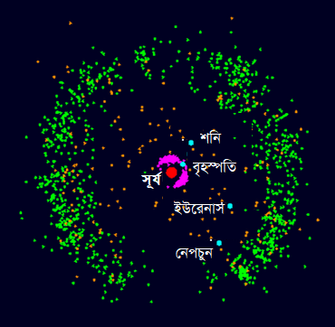

# সৌরজগৎ {#solar-sytem}

## আমাদের সৌরজগত কত বড়?

পৃথিবীতে বসে থেকে আমরা সৌরজগতের কিয়দাংশই দেখতে পাই। আমরা কী কীই বা আর দেখি? দিনে সূর্যের প্রখর তেজ, রাতের আকাশের কোমল চাঁদ ও আরও কিছু গ্রহ। কিন্তু আমাদের সৌরজগতের চৌহদ্দি অত অল্প নয়। তাহলে, প্রশ্ন দাঁড়ায়, আমাদের সৌরজগত ঠিক কত বড়?

হিসাব দেবার আগে হিসাবের এককটা দেখে নেই। মহাকাশের দূরত্বগুলো এত বিশাল যে আমাদের এসআই একক (SI unit) মিটার তো দূরের কথা, কিলোমিটারও পাত্তা পায় না। মহাকাশবিদরা তাই অ্যাস্ট্রোনোমিকেল ইউনিট (astronomical unit বা এইউ) নামে একটি একক ব্যবহার করেন। এই এককটার মান হচ্ছে পৃথিবী থেকে সূর্যের গড় দূরত্ব বা ১৫ কোটি কিলোমিটারের সমান।

বুধ গ্রহ (Mercury) সূর্য থেকে মাত্র .৩৯ এইউ (AU) দূরে। আর বৃহস্পতি (Jupiter) সূর্যের ৫.৫ এইউ দূরত্বে থেকে সূর্যকে প্রদক্ষিণ করছে। সবচেয়ে দূরের গ্রহ নেপচুনের দূরত্ব সূর্য থেকে ৩০.২ এইউ, যা ৪,৫০৩ মিলিয়ন কিলোমিটারের সমান। প্লুটোর দূরত্ব ৩৯.২ এইউ। প্লুটো এখন বামন গ্রহ হলেও সৌর পরিবার থেকে তো আর নির্মূল হয়নি!

দ্রুতবেগে ছোটা হাইওয়েগামী গাড়ি (ধরলাম বেগ ঘণ্টায় প্রায় ১১৫ কিলোমিটার) নিয়ে সূর্য থেকে নেপচুনে যেতে প্রায় ৪৬ হাজার বছর লেগে যাবে।

কিন্তু আমাদের সৌরজগতের দৌড় এখানেই শেষ নয়। গ্রহদের চৌহদ্দি যেখানে শেষ, সৌরজগতের পরিধি তার চেয়েও বহু দূর অবধি বিস্তৃত। 

সৌরজগতের সবচেয়ে দূরবর্তী বামন গ্রহ (dwarf planet) হল এরিস (Eris)। এও কিন্তু সৌরজগতের একটি ক্ষুদ্র গণ্ডির মধ্যেই পড়ে আছে। আবার, সৌরজগতের ৩০ এইউ থেকে ৫০ এইউ পর্যন্ত অর্থাৎ সাড়ে ৭ বিলিয়ন অঞ্চল জুড়ে কাইপার বেল্ট (Kuiper belt) বিস্তৃত। এই বেল্টের মধ্যে আছে প্লুটো, ইরিস, মেইকমেইক ও হাউমেয়া বামন গ্রহরা। 
 

(\#fig:kuiper)Kuiper Belt

চিত্র \@ref(fig:kuiper): কাইপার বেল্ট

সবে তো শুরু!

আরও দূরে, প্রায় ৫০-২০০ এইউ দূরত্বে দেখা মিলবে প্রান্ত সীমার। এটা হচ্ছে সেই সীমানা, যেখান পর্যন্ত সেকেন্ডে ৪০০ কিলোমিটার বেগে ধেয়ে যায় সৌর বায়ু (solar wind) সংঘর্ষে লিপ্ত হয় আন্তঃতারকা পদার্থের সাথে। এই পদার্থগুলো আবার একীভূত হয়ে ধূমকেতুর মত লেজ তৈরি করে, যার বিস্তৃতি হয় সূর্য থেকে ২৩০ এইউ পর্যন্ত।

কিন্তু, সৌরজগতের সত্যিকার বিশালতা বোঝা যাবে এর অভিকর্ষের পাল্লা থেকে অর্থাৎ যে দূরত্ব পর্যন্ত কোনো বস্তু সূর্যকে কেন্দ্র করে ঘুরতে পারে।

(\#fig:oort)Oort Cloud

চিত্র: ওর্ট ক্লাউড সহসৌরজগত

সৌরজগতের দূরবর্তী পরিসর হচ্ছে ওর্ট ক্লাউড পর্যন্ত। ওর্ট ক্লাউড হচ্ছে এক গুচ্ছ ক্ষুদ্র ক্ষুদ্র হিমেল (icy) গ্রহের সমষ্টি। এরা ১ লক্ষ এইউ দূরত্বে থেকে সূর্যকে প্রদক্ষিণ করছে। এই দূরত্ব ১.৮৭ আলোক বর্ষের সমান। যদিও আমরা ওর্ট ক্লাউডকে সরাসরি দেখি না, মনে করা হয় যেসব লং পিরিয়ড ধূমকেতু (comet) সৌরজগতের নিকটবর্তী অংশে চলে আসে, তাদের উৎপত্তি এখানে।

সূর্যের অভিকর্ষ নিজের বাড়ি পেরিয়ে ২ আলোক বর্ষব্যাপী বিস্তৃত। এই পাল্লা সূর্য থেকে এর নিকটতম তারকা প্রক্সিমা সেন্টোরির দূরত্বের প্রায় অর্ধেক। বিশ্বাস করুন আর নাই করুন, এই অঞ্চলের মধ্যবর্তী যে কোন বস্তু সূর্যকে প্রদক্ষিণ (revolve) করবে।
আগের সেই গাড়িটার কথা মনে আছে? ঐ গাড়িটার এই দূরত্ব পাড়ি দিতে প্রায় ২ কোটি বছর লাগবে! পৃথিবী থেকে  নিক্ষিপ্ত সর্বাধিক বেগের নাসার মহাকাশযান নিউ হরাইজন (New Horizon) একই কাজ করতে ৩৭ হাজার বছর সময় নেবে। এর গতি সেকেন্ডে ১৬.২৬ কি.মি বা ঘণ্টায় ৫৮, ৫৩৬ কি.মি। 

সূত্র: ইউনিভার্স টুডে, ইংরেজি উইকিপিডিয়া। 

## সূর্যের লুকানো রহস্য

এ অংশটি এখনও উন্মুক্ত নয়

## কেপলার গ্রহের সূত্র কোথায় পেলেন? 

একটানা কয়েক রাত রাতের আকাশের দিকে নজর রাখলে দারুণ একটি ব্যাপার আপনার চোখে পড়বে। দেখবেন যে প্রতি রাতেই তারারা একটু একটু করে পশ্চিমে সরে যাচ্ছে। একটি নিদিষ্ট রাতে তো সরে অবশ্যই। এর পাশাপাশি সাধারণত একটি তারা প্রতি রাতে আগের রাতের প্রায় চার মিনিট আগেই একই অবস্থানে চলে আসে। এক বছর পর একে ঠিক আগের সময়ে আগের জায়গায় দেখা যায়।  

(\#fig:stars)Stars

কিন্তু গ্রহরা এই নিয়ম মানে না। দূরের তারাদের তুলনায় কখনও এরা বেশি পশ্চিমে চলে যায়। কখনও আবার পরের রাতে দেখা যায় এরা আগের চেয়ে পূর্ব দিকে চলে এসেছে। প্রাচীন কালে গ্রহদের এই আচরণ ছিল ব্যাখ্যাতীত। এরিস্টটলীয় মতবাদ অনুসারে পৃথিবী ছিল মহাবিশ্বের কেন্দ্রে। এই ধারণার ভিত্তিতে গ্রহদের গতির ব্যাখ্যা দেবার জন্যে টলেমি প্রস্তাব করলেন দূরের তারাদের পাশাপাশি গ্রহরাও পৃথিবীর চারদিকে ঘুরছে। তবে এরা আবার তার পাশাপাশি নিজেরা আবার একটি বৃত্তপথে ঘুরছে। এই পথের নাম ছিল মন্দবৃত্ত (epicycle)। 

(\#fig:ptolemy-model)Ptolemy's Mdoel

কিন্তু এই মডেল সঠিক হলে কখনও কখনও চাঁদকে দ্বিগুণ কাছে দেখা যাবার কথা। তার মানে ভুল আছে এতে। কিন্তু ভুলটি ঠিক কোথায়? আর সঠিক মডেলটিই বা কী? 

সেই গ্রিকদের আমলেই অ্যারিস্টার্কাসসহ অনেকে পৃথিবীর বদলে সূর্যকে মহাবিশ্বের কেন্দ্রে চিন্তা করতেন। ১৫৪৩ সালে কোপার্নিকাস এই মতবাদকে নতুন করে আলোচনায় নিয়ে আসেন। এর আগে ইসলামী জ্যোতির্বিদদের কেউ কেউও কাছাকাছি ধারণা প্রস্তাব করেন। যেমন আবু সাঈদ আল সিজ্জী বলেন, আকাশের তারাদের চলাচলের কারণ আসলে পৃথিবীর নিজ অক্ষের সাপেক্ষে ঘূর্ণন। 

কিন্তু সঠিক জ্ঞান জানতে হলে চাই পর্যবেক্ষণ থেকে পাওয়া তথ্য। কাজটি নিজের ঘাড়ে চাপিয়ে নিলেন টাইকো ব্রাহে। এই মহান জ্যোতির্বিদ ১৫৪৬ সালে জগ্রহন করেন ডেনমার্কে। তাকেঁ আধুনিক জ্যোতির্বিদ্যার প্রথম সক্ষম চিন্তাবিদ বলা হয়। রাতের পর রাত অমানুষিক পরিশ্রম করে তিনি যে পর্যবেক্ষণগুলো জড় করলেন তা প্রচলিত তথ্যের চেয়ে ছিল পাঁচ গুণ সঠিক। তখনও কিন্তু টেলিস্কোপেরও প্রচলন ঘটেনি। টেলিস্কোপের সহায়তা ছাড়া কাজ করা উল্লেখযোগ্য জ্যোতির্বিদদের মধ্যেও তিনিই সর্বশেষ। তবুও তারঁ পর্যবেক্ষণগুলো এক দিকে যেমন ছিল নির্ভুল, তেমনি পরিমাণেও ছিল বিশাল। 

কোপার্নিকাসের মডেলের জ্যামিতিক সুবিধা তাঁর দৃষ্টি আকর্ষণ করে। পর্যবেক্ষণ থেকে তিনি সঠিকভাবে বুঝতে পারেন যে চাঁদ পৃথিবীর চারদিকে ঘুরছে। গ্রহরা ঘুরছে সূর্যের চারদিকে। তবে তিনি ভুল করে মনে করেন বসেন যে সূর্য ঘুরছে পৃথিবীর চারদিকে। অথ্যাৎ, তিনি কোপার্নিকান মডেলের সাথে পুরোপুরি একমত ছিলেন না। কেপলারসহ অন্যান্য কোপার্নিকান জ্যোতির্বিদরা তাঁকে সৌরকেন্দ্রিক মডেল মেনে নেবার জন্যে বোঝাতে চেষ্টা করে ব্যর্থ হন। ভুল ধারণা মাথায় নিয়েই ১৬০১ সালে তিনি মৃত্যুবরণ করেন। 

(\#fig:ptolemy-moon)Outcome of Ptolemy's Mdoel

 
কেপলারের জš§ ১৫৭১ সালে। তাঁর দেশ হল জার্মানি। ক্যারিয়ারে উল্লেখযোগ্য সময় তিনি গণিতের শিক্ষক হিসেবে বিভিন্ন প্রতিষ্ঠানে সময় দেন। ১৬০০ সালের ফেব্রুয়ারিতে টাইকোর সাথে তাঁর দেখা হয়। এ সময়ই প্রাগ শহরে টাইকো দুইজন সহকারীকে নিয়ে তাঁর যুগান্তকারী পর্যবেক্ষণগুলো সংগ্রহ করছিলেন। পরের দুই মাস তিনি টাইকোর বাড়িতে বেড়ালেন। চিন্তা ভাবনা করলেন মঙ্গল গ্রহ সম্পর্কে পাওয়া তথ্যগুলো। প্রথম দিকে টাইকো নিজের উপাত্তগুলো খুব সযত্নে লুকিয়ে রাখতেন। কিন্তু কেপলারের তাত্ত্বিক জ্ঞান তাঁকে যথেষ্ট মুগ্ধ করে। ফলে কেপলার আগের চেয়ে বেশি তথ্য নিয়ে চিন্তা করার সুযোগ পেলেন। 

তবে হঠাৎ করে টাইকোর সাথে সম্পর্ক খারাপ হয়ে গেল। শেষ পর্যন্ত সম্পর্ক আবার জোড়া লাগল। পরিবারকে নিয়ে ফিরে আসার জন্যে বাড়ি এসে বিভিন্ন কারণে আর সাথে সাথে ফিরতে পারলেন না। এটা হল জুন মাসের কথা। শেষ পর্যন্ত আগস্টে ফিরে এলেন টাইকো ব্রাহের কাছে। একত্রে কাজ শুরু হল পুরোদমে। ১৬০১ সালে অক্টোবরে আকস্মিকভাবে টাইকোর মৃত্যু হলে তাঁর অসমাপ্ত কাজের ভার পড়ে কেপলারে ওপর। 

দীর্ঘ দিন সাধনা করে ১৬০৯ সালে তিনি গ্রহের গতির প্রথম দুটি সূত্র এবং ১৬১৯ সালে তৃতীয় সূত্র প্রকাশ করেন। প্রথম সূত্র থেকেই জানা গেলে যে গ্রহরা সূর্যের চারদিকে উপবৃত্তাকার কক্ষপথে ঘোরে। সূর্যের চারদিকে গ্রহদের ঘোরার বিষয়টি প্রমাণিত হলেও আরো বহু দিন যাবত সূর্যকে পুরো মহাবিশ্বের কেন্দ্র ভাবা হত। আঠারো শতকে এসে ধারণা তৈরি হয় যে, না, মিল্কিওয়ে গ্যালাক্সিরই কেন্দ্রই হয়ত মহাবিশ্বের কেন্দ্র। 

আর এখন? এখন আমরা জানি মহাবিশ্বের কেন্দ্রই নেই। কেন নেই সেটা জানুন \@ref(center) অংশে। 

সূত্র: কিউরিয়াস অ্যাস্ট্রো, ইংরেজি উইকিপিডিয়া

এ অংশটি এখনও উন্মুক্ত নয়

## গ্রহদের অদ্ভুত উলটো গতি

এ অংশটি এখনও উন্মুক্ত নয়

## শনি গ্রহ বলয় পেল কোথায়

এ অংশটি এখনও উন্মুক্ত নয়

## ধূমকেতু লেজ পায় কোথায়

এ অংশটি এখনও উন্মুক্ত নয়

## চাঁদের বুকে পৃথিবীর অক্সিজেন

এ অংশটি এখনও উন্মুক্ত নয়

## পৃথিবীর ২য় চাঁদ

এ অংশটি এখনও উন্মুক্ত নয়

## কোথায় গেল মঙ্গলের পানি

এ অংশটি এখনও উন্মুক্ত নয়

## অলিম্পাস মনস: সৌরজগতের উচ্চতম আগ্নেয়গিরি

এ অংশটি এখনও উন্মুক্ত নয়

## যে যান মানুষকে মঙ্গলে নেবে

এ অংশটি এখনও উন্মুক্ত নয়

## নবম গ্রহের সন্ধানে

এ অংশটি এখনও উন্মুক্ত নয়

## প্লুটোর গ্রহত্ব হারানো কাহিনি

এ অংশটি এখনও উন্মুক্ত নয়

## মহাবিশ্বের সবচেয়ে উত্তপ্ত গ্রহ

এ অংশটি এখনও উন্মুক্ত নয়

## সৌরজগতের বাইরে বৃহত্তম গ্রহ

এ অংশটি এখনও উন্মুক্ত নয়

## নতুন বাসযগ্য গ্রহ

এ অংশটি এখনও উন্মুক্ত নয়

## স্পেস ট্রেনে মহাকাশ ভ্রমণ  

এ অংশটি এখনও উন্মুক্ত নয়
