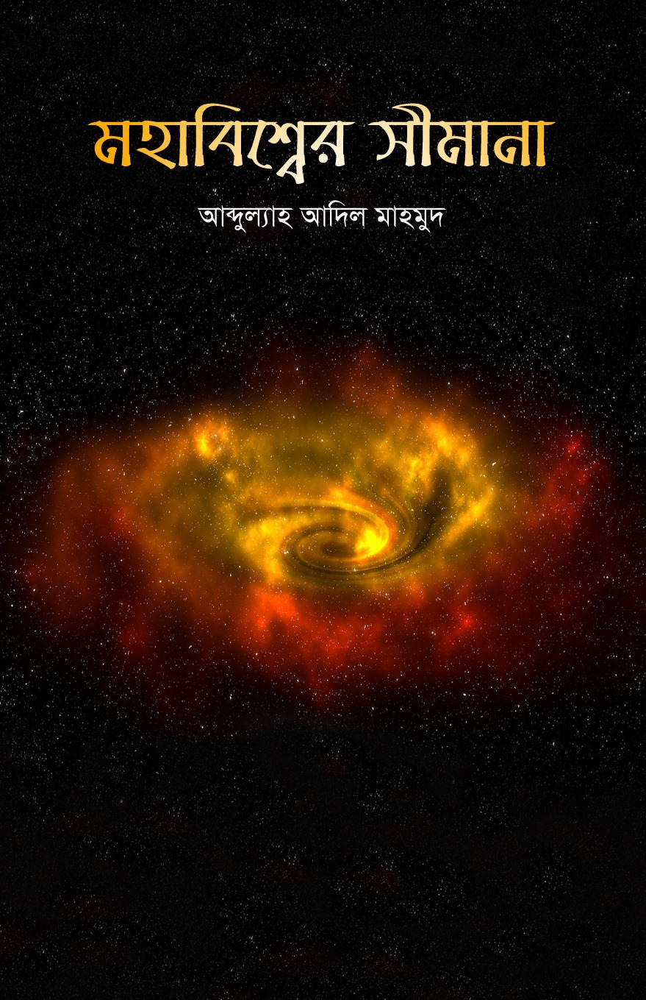

--- 
title: "মহাবিশ্বের সীমানা"
author: "আব্দুল্যাহ আদিল মাহমুদ"
date: "2020-11-09"
site: bookdown::bookdown_site
output: bookdown::gitbook
documentclass: book
bibliography: [book.bib, packages.bib]
biblio-style: apalike
link-citations: yes
github-repo: mahmudstat/ms
description: "মহাবিশ্বের সীমানা"
---

# বই পরিচিতি {-}

(\#fig:cover)Book Cover

## প্রকাশনা {-}

*মহাবিশ্বের সীমানা* বইটি বইটি একুশে বইমেলা-২০১৯-এ অন্বেষা প্রকাশন থেকে প্রকাশিত হয়। 

### ওয়েব সংস্করণ {-}

এই ওয়েব সংস্করণের সর্বশেষ আপডেট: 2020-11-09 10:31:36

## বিষয়বস্তু  {-}

এক সময় ধারণা ছিল মহাবিশ্বের কোনো শুরু বা শেষ নেই। কিন্তু এখন আমরা জানি মোটামুটি ১৩৮০ কোটি বছর আগে এক মহাবিস্ফোরণের মাধ্যমে মহাবিশ্বের জন্ম। জন্ম থেকেই প্রসারিত হচ্ছে মহাবিশ্ব। প্রতি মুহূর্তে বড় হয়ে যাচ্ছে। কিন্তু কোথায় প্রসারিত হচ্ছে? এই মহাবিশ্বের শেষই বা কোথায়? প্রশ্নটি শুধু কিশোর মনে নয়, জাগে বড়দের মনেও। আর যেখানে মহাবিশ্বের শেষ, তার পরেই বা কী আছে? সেখানে আগে থেকে কী ছিল? কী আছে আমাদের চেনা-জানা মহাবিশ্বের বাইরে? 

এসব প্রশ্নের গভীরে প্রবেশের চেষ্টা দিয়ে শুরু হয়েছে বইটি। তারপর একে একে থাকছে আকাশ পর্যবেক্ষণ ও তার কিছু বাস্তুব প্রয়োগ নিয়ে আলোচনা। এই যেমন **সূর্য দেখে খালি হাতি কীভাবে দিক নির্ণয়** করা যাবে। 

আছে পৃথিবী ও সৌরজগৎ নিয়ে নতুন আবিষ্কৃত ও সাধারণ কিছু কথা। 

আছে আপেক্ষিকতা তত্ত্বের সংক্ষিপ্ত ও সহজবোধ্য আলোচনা। আশা করি সুপ্রিয় পাঠকের জ্ঞান অনুসন্ধিৎসায় নতুন কিছু দিগন্ত খুলে দেবে বইটি। 

## লেখক পরিচিতি {-}

**আব্দুল্যাহ আদিল মাহমুদ** 

(\#fig:author)Author

*পাবনা ক্যাডেট কলেজে* পরিসংখ্যান বিভাগের প্রভাষক হিসেবে কর্মরত। এর আগে রিসার্চ অ্যাসিস্ট্যান্ট হিসেবে কাজ করেছেন *ইঞ্জিনিয়ার্স অ্যান্ড অ্যাডভাইজরস লিমিটেড (EAL)* প্রতিষ্ঠানে।  ঢাকা বিশ্ববিদ্যালয়ের পরিসংখ্যান বিভাগ থেকে **অনার্স** ও **মাস্টার্স** ডিগ্রি অর্জন করেছেন। 

লেখালেখির সূচনা গণিত ম্যাগাজিন *পাই জিরো টু ইনফিনিটি*র মাধ্যমে। কন্ট্রিবিউটর হিসেবে কাজ করেছেন *প্রথম আলো* পরিবারের মাসিক বিজ্ঞান ম্যাগাজিন *বিজ্ঞানচিন্তা*য়। *কিশোরআলো*, *ব্যাপন*সহ বিভিন্ন ম্যাগাজিনে নিয়মিত লিখছেন গণিত, পরিসংখ্যান ও জ্যোতির্বিজ্ঞান নিয়ে। এছাড়া বিজ্ঞান বিষয়ে অনলাইনেও সক্রিয়ভাবে লেখালেখি করছেন। 

বাংলায় জ্যোতির্বিজ্ঞানকে জনপ্রিয়করণ ও সহজে উপস্থাপন করার জন্যে তৈরি করেছেন অনলাইন পোর্টাল [*বিশ্ব ডট কম*](https://sky.bishwo.com)।  একই উদ্দেশ্যে পরিসংখ্যান ও ডেটা সায়েন্স নিয়ে তৈরি করেছেন [*Stat Mania*](https://www.statmania.info)।

**প্রিয় শখ:** নতুন কিছু শেখা (বিশেষ করে গণিত ও জ্যোতির্বিজ্ঞান), প্রোগ্রামিং, ভ্রমণ ও রাতের আকাশ পর্যবেক্ষণ। 

**পৈত্রিক নিবাস:** লক্ষ্মীপুর সদর উপজেলার ঝাউডগী গ্রাম।

## লেখকের অনান্য বই {-}

- *[অ্যা ব্রিফার হিস্ট্রি অব টাইম](https://www.rokomari.com/book/author/47631)* (২০১৭) (অনুবাদ, মূল স্টিফেক হকিং ও লিওনার্দ ম্লোডিনো)
- *[অসীম সমীকরণ](https://www.rokomari.com/book/author/47631)* (২০১৯) 
- [*চন্দ্রজয়ের ৫০ বছর* (২০২০) (প্রথিতযশা কয়েকজন লেখকের সাথে যৌথভাবে)](https://www.rokomari.com/book/194398/chandrojoyer-50-bochor)
- *[লাস্ট থ্রি মিনিটস](https://l3m.bishwo.com)* (২০২১) 

**ইমেইল:** almahmud.sbi@gmail.com

**ওয়েবসাইট:** [mahmud.statmania.info](https://mahmud.statmania.info)

**ফেসবুক:** [mahmud.sbi](https://fb.com/mahmud.sbi)

## ভূমিকা {-}

শৈশবে ভাবতাম, পৃথিবী না জানি কত বড়? কোথায় এর শেষ? যেখানে শেষ তার পরে কী আছে? মানুষ কি পৃথিবীর বাইরে যেতে পারে? একটু বড় হয়ে প্রশ্নগুলোর উত্তর পেলাম। বরং প্রশ্নগুলোকেই লেগেছে হাস্যকর। 

কিন্তু প্রশ্নগুলোতে যদি পৃথিবী শব্দটি কেটে ‘মহাবিশ^’ বসিয়ে দেই, তাহলে আর হাস্যকর থাকে না। মহাবিশে^র যেখানে শেষ আসলেই তার পরে কী আছে? প্রশ্নটির উত্তর পৃথিবীর প্রশ্নের মতো অত সোজা নয়। সেটাই আলোচিত হয়েছে মহাবিশে^র সীমানা বইয়ের শুরুর অংশে। বাকি অংশে রয়েছে প্রত্যক্ষ বা পরোক্ষভাবে প্রাসঙ্গিক কিছু লেখার সংকলন। 

বইটির অধিকাংশ লেখাই ইতোপূর্বে বিজ্ঞানচিন্তা, ব্যাপন ও জিরো টু ইনফিনিটিসহ বিভিন্ন ম্যাগাজিনে ছাপা হয়েছিল। উল্লেখযোগ্য পরিমাণ লেখা ছিল আবার আমার মহাকাশ চর্চার ওয়েবসাইট বিশ^ ডট কমের মহাবিশ^ বিভাগে (ংশু.নরংযড়ি.পড়স)। 

বিজ্ঞান বিষয়ে লিখতে গিয়ে মাঝে মাঝে নিজের কাছে প্রশ্ন করি, নিজে বিজ্ঞানী না হয়ে কি বিজ্ঞান বিষয়ে লেখালেখি করা উচিৎ? প্রশ্নটা আসার কারণ হলো, এ কাজ করতে গিয়ে হয়ত অনেক সময় লেখকরা (আমিও) বিজ্ঞানের মূল ধারণাগুলো থেকে সরে আসেন। তবুও লেখার সপক্ষে আমার যক্তি হলো, জ্ঞানের চর্চার স্বার্থে লেখালেখি হওয়া উচিৎ। উপরন্ত বিজ্ঞানীরা সব সময় বিজ্ঞানকে সাধারণ মানুষের কাছে তুলে ধরার সময় পান না। অথচ বিজ্ঞানের ধারণাগুলো সাধারণ মানুষেরও জানা প্রয়োজন। নতুন নতুন তত্ত্ব ও  ধারণার সাথে পরিচিত থাকা প্রয়োজন। 

বিজ্ঞানের সঠিক জ্ঞানের অভাবেই আজকের আধুনিক পৃথিবীতেও ফ্ল্যাট আর্থ সোসাইটি নামে সংগঠনের অস্তিত্ব আছে। এমনকি তারা ২০১৭ সালের নভেম্বরে যুক্তরাষ্ট্রের নর্থ ক্যারোলিনায় একটি বড় সম্মেলনও করেছে। বিজ্ঞানের অগগ্রতির জন্যে এসব ধারণা ক্ষতিকর। 

  লেখায় ভুল এড়াতে আমি চেষ্টা করি বেশি তাত্ত্বিক বিষয়ের আলোচনা না আনতে। তাত্ত্বিক বিষয়কে সহজ করে বলার চেষ্টা করার বদলে চেয়ে বেশিরভাগ সময় চেষ্টা করি তথ্যনির্ভর লেখা লিখতে। সঠিক তথ্যসূত্র দেখে লিখলে এক্ষেত্রে ভুলের সম্ভাবনা কমে আসে। যেমন ধরুন, এ বইয়ের ‘উজ্জ্¦ল তারাদের গল্প’ লেখাটি। লেখাটি তথ্য ও নিজস্ব পর্যবেক্ষণ নির্ভর। তাত্ত্বিক আলোচনা কম। 

বিজ্ঞান লেখালেখির সাথে যুক্ত আছি পাঁচ বছরের বেশি সময় ধরে। কিন্তু লেখালেখির সঠিক ধারাটা বুঝতে সময় লেগেছে। এ বিষয়ে সবচেয়ে বেশি সহায়তা পেয়েছি বিজ্ঞানচিন্তার সহসম্পাদক বড় ভাই তুল্য আব্দুল গাফফার রনি ভাই ও নির্বাহী সম্পাদক আবুল বাসার ভাই এর কাছ থেকে। এ দুজনের অবদান কখনও ভুলব না। অ্যা ব্রিফার হিস্ট্রি অব টাইম প্রকাশ করার ব্যাপারেও রনি ভাইয়ের অকৃত্রিম সহায়তা ও তত্ত্বাধান পেয়েছিলাম। এ বইটিও ভাইয়ের দেয়া উৎসাহের ফসল। 

বই প্রকাশের আন্তরিকতা প্রদর্শন ও উৎসাহ প্রদানের অন্বেষার প্রকাশক মো. শাহাদাৎ হোসেন ভাইকেও ধন্যবাদ। বইয়ের বিষয়বস্তু উপযোগী একটি প্রচ্ছদ করে দেওয়ার জন্যে আনোয়ার হোসেন ভাইকেও ধন্যবাদ না দিলেই নয়। 

এটি আমার প্রথম মৌলিক বই। বই নিয়ে কাজ করার সময়গুলোও বিভিন্ন ব্যস্ততার মধ্য দিয়ে যেতে হয়েছিল। সব মিলিয়ে বইটিতে ছোট-বড় ভুল-ত্রুটি থেকে যাওয়া অসম্ভব নয়। বিজ্ঞ পাঠকের চোখে এমন কোনো ভুল চোখে পড়লে ইমেইলে বা ফেসবুকে জানানোর অনুরোধ করছি। 

মাহমুদ

মতিঝিল, ঢাকা

## বই কিনতে {-}

সারা দেশের বিক্রয়কেন্দ্রগুলোতে পাওয়া যাবে বইটি। পাওয়া যাবে [রকমারি ডট কমেও](https://www.rokomari.com/book/author/47631)। 
